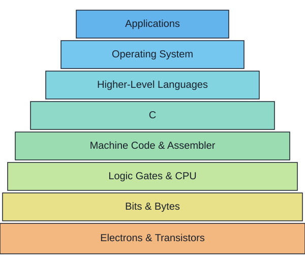
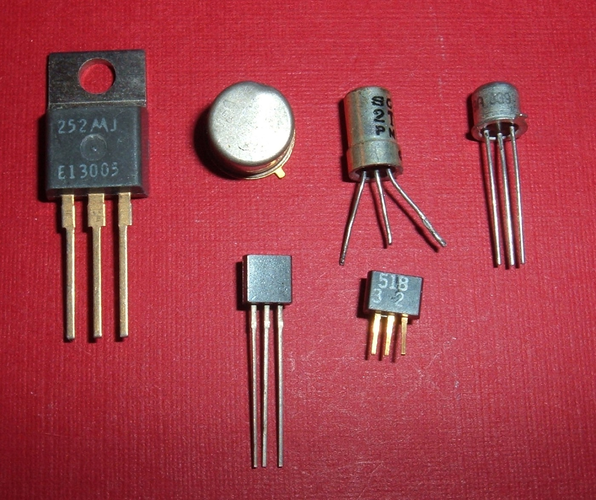
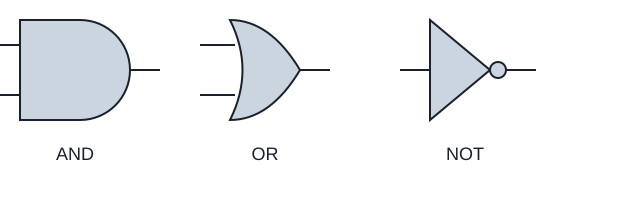
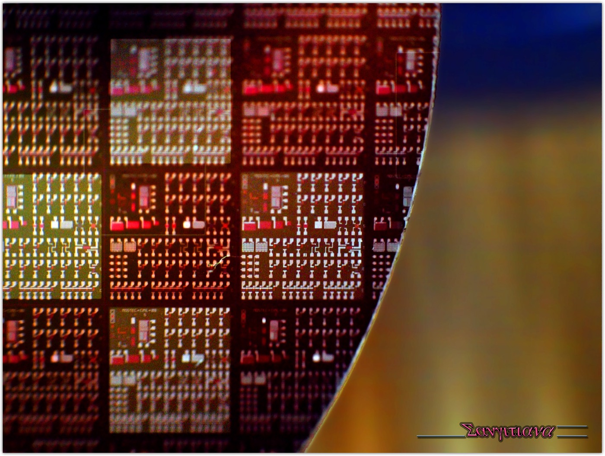
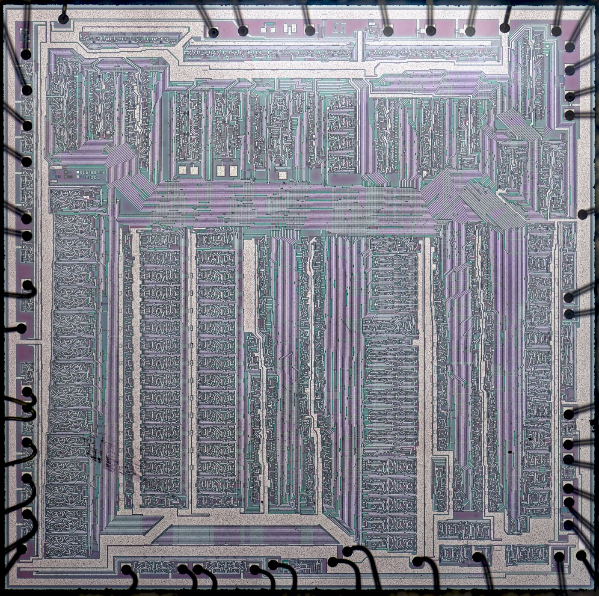

<!-- _class: lead -->
# From Electrons to Apps
## Levels of Abstraction in Computing

A 1-hour journey from physics to the apps you use every day

---

## What actually happens when you double-click an icon?

- Somewhere, **electrons** start moving in a very specific pattern
- By the end of this hour, you'll be able to explain *every step*
  between "electron" and "app opens"

---

## The Abstraction Tower 🗼



We'll climb it floor by floor:

1. Electrons & Transistors
2. Bits & Bytes
3. Logic Gates → CPU
4. Machine Code & Assembler
5. C — the "portable assembler"
6. Higher-Level Languages
7. Operating Systems
8. User Applications

*(This slide comes back between every section — watch the current floor light up)*

---

<!-- _class: lead -->
# 1. Electrons & Transistors
### Floor 0 — Physics

---

## It starts with electricity

- Electricity = electrons flowing through a wire
- We can measure it as **voltage**: high voltage or low voltage
- Computers only care about **two states**: voltage present or not
  - High voltage → **1**
  - Low voltage → **0**

---

## The transistor: a switch controlled by electricity



- A transistor is a tiny switch
- Normally, switches are flipped by hand (light switch)
- A transistor is flipped by **another electrical signal**
- This means: *electricity can control electricity*

*Photo: real discrete transistors — modern chips shrink these to billions per chip*

---

## Why does that matter?

- If one signal can turn another on/off...
- ...we can chain millions of them together
- Each transistor makes a tiny **decision**: pass current, or don't

---

## From switches to logic gates



- Combine a few transistors → build a **logic gate**
- Logic gates: AND, OR, NOT
  - AND → true only if *both* inputs are on
  - OR → true if *either* input is on
  - NOT → flips the signal

**Key idea:** everything below this point is just physics turning into a yes/no signal.

---

<!-- _class: lead -->
# 2. Bits & Bytes
### Floor 1 — Representing Information

---

## The bit

- **Bit** = one on/off signal = one 0 or one 1
- The smallest unit of information a computer can store

---

## The byte

- **Byte** = a group of 8 bits
- Example: `0000 0001`
- A single byte can represent 256 different values (0–255)

```
0000 0000  = 0
0000 0001  = 1
0000 0010  = 2
0000 0011  = 3
...
1111 1111  = 255
```

---

## Why binary, not decimal?



- Building a reliable switch with exactly 2 states (on/off) is easy
- Building a reliable switch with 10 states would be very hard
- Binary isn't a choice for convenience — it's a choice for **reliability**

*Photo: a silicon wafer — the raw material chips are cut from*

---

## Bits represent *everything*

- Numbers → straightforward binary counting
- Letters → each letter mapped to a number (e.g. ASCII: 'A' = 65)
- Colors → red/green/blue values as numbers
- Sound → sampled amplitude values, thousands of times per second

**Key idea:** bits don't "know" what they mean — the program interpreting them decides.

---

<!-- _class: lead -->
# 3. Logic Gates → CPU
### Floor 2 — Building a Calculator from Switches

---

## Combining gates: an adder

- Take two 1-bit numbers, want to add them
- A small circuit of AND/OR/NOT gates can compute the sum + carry
- This is a real circuit: **the binary adder**

---

## Zoom out: millions of these



- Chain adders together → add whole bytes, whole numbers
- Add more circuits → multiply, compare, move data around
- Package **millions to billions** of transistors into one chip

## That chip is the CPU

*Photo: a real microprocessor die, magnified — every rectangle is functional circuitry*

---

## Two more ingredients

- **Registers** — tiny, extremely fast storage slots inside the CPU
- **Clock** — a ticking signal that paces every step
  (modern CPUs tick billions of times per second — GHz)

**Key idea:** the CPU is a huge, fast calculator made entirely of on/off switches.

---

<!-- _class: lead -->
# 4. Machine Code & Assembler
### Floor 3 — Talking to the CPU

---

## Machine code

- The CPU only understands raw binary instructions
- Example (simplified): `10110000 01100001`
  → "put the value 97 into register A"
- Every CPU family has its own machine code "dialect"

---

## Assembler: a thin translation layer

- Machine code is unreadable for humans
- **Assembly language** gives instructions short names:

```asm
MOV A, 97   ; put 97 into register A
ADD A, B    ; add register B to register A
JMP loop    ; jump back to "loop"
```

- Each assembly line maps almost 1:1 to one machine code instruction

---

## 🎥 Demo: peeking at real machine instructions

- Compile a tiny "Hello World" program
- Run `objdump -d` (or similar) on it
- Look at the disassembly: short, cryptic instructions
- *You don't need to understand every line — just see that it's real and small*

**Key idea:** assembler is a direct, human-readable translation of machine code.

---

<!-- _class: lead -->
# 5. C — the "Portable Assembler"
### Floor 4 — Structured, Reusable Code

---

## The problem with assembly

- Tied to *one specific* CPU type
- Extremely tedious to write
- Very easy to make mistakes (no safety nets)

---

## Enter C

```c
int add(int a, int b) {
    return a + b;
}
```

- Introduces **variables**, **functions**, **loops** as readable text
- Still maps closely to what the machine actually does
- Nicknamed "portable assembler" — same ideas, works on many CPUs

---

## The compiler

- A program that translates C source code → machine code
- Different compiler per target CPU, same C source code
- This is what makes C "portable"

## Where C lives today

- Operating system kernels (Linux, parts of Windows/macOS)
- Embedded systems (microwaves, cars, routers)
- Performance-critical software

---

<!-- _class: lead -->
# 6. Higher-Level Languages
### Floor 5 — Closer to Human Thinking

---

## The problem C still has

- You manage memory yourself (easy to get wrong)
- Verbose — lots of code for simple ideas
- Still thinking like the machine, not like a human

---

## Higher-level languages

- Python, JavaScript, Java, and many others
- Automatic memory management — the language cleans up after you
- Rich ecosystems: huge libraries for almost any task
- Example — same idea as our C function, in Python:

```python
def add(a, b):
    return a + b
```

---

## Compiled vs. interpreted (just the vocabulary)

- Some languages are **compiled ahead of time** (like C)
- Some languages are **interpreted** — translated and run on the fly
- Many modern languages do a mix of both
- *(We'll go deeper into this in a future lecture)*

**Key idea:** every layer trades a bit of performance/control for speed of writing and readability.

---

<!-- _class: lead -->
# 7. Operating Systems
### Floor 6 — Sharing the Machine

---

## What does an OS actually do?

- Manages the hardware: CPU, memory, disk, screen, network
- Shares that hardware safely between **many** running programs
- Without it, every app would need to know how to talk to every device directly

---

## A few key concepts

- **Process** — a running program, with its own slice of memory and CPU time
- **File** — a named chunk of data stored on disk, managed by the OS
- **Driver** — small piece of software that lets the OS talk to specific hardware

---

## Same idea, different implementations


- **Windows**, **macOS**, **Linux** (and Android, which is built on Linux)
- All solve the same core problems: process management, files, drivers, security
- Different design choices, same fundamental job

*Tux the penguin — mascot of the Linux kernel*

---

## 🎥 Demo: seeing processes live

- Open Task Manager (Windows) or Activity Monitor (macOS)
- Point out: dozens of processes running *right now*
- This is the OS doing its job, visibly, in real time

---

<!-- _class: lead -->
# 8. User Applications
### Floor 7 — What You Actually See

---

## Apps are built on everything below

- A browser, a game, a word processor:
  - Written in a higher-level language (or C/C++)
  - Compiled/interpreted down through the layers
  - Uses OS services (files, network, screen, input)
  - Ultimately runs as CPU instructions
  - Which are, in the end, electrons flipping switches — billions of times per second

---

## Full circle 🔄

**Double-click icon**
→ OS loads the program into memory
→ CPU starts executing its instructions
→ Instructions are just patterns of bits
→ Bits are just voltage levels
→ Voltage levels are just electrons moving through transistors

---

<!-- _class: lead -->
# Putting It All Together

---

## The full ladder, one line each

1. **Electrons** flow through transistors (switches)
2. Transistors form **logic gates**
3. Logic gates form a **CPU** that runs **bits & bytes**
4. The CPU executes **machine code**, written via **assembler**
5. **C** gives structure while staying close to the machine
6. **Higher-level languages** let us think more like humans
7. The **operating system** shares hardware between programs
8. **Applications** are what we actually see and use

---

<!-- _class: lead -->
# Programming is choosing which floor of this tower to work on.

## Questions?

---

<!-- _footer: "" -->
## Image Credits

- Diagrams (tower, logic gates): original, made for this deck
- Transistors photo: ArnoldReinhold, CC BY-SA 3.0, Wikimedia Commons
- Silicon wafer photo: Sangitiana Fararano, CC BY-SA 2.0, Wikimedia Commons
- CPU die photo: Revaldinho, CC BY 4.0, Wikimedia Commons
- Tux: Larry Ewing / Simon Budig / Anja Gerwinski, Wikimedia Commons

*(full details in `images/CREDITS.md`)*
